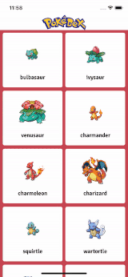

# Pokedex

Pokedex is an application that helps you find all you want to know about your favourite pokemons.

This project is still in progress and it is a SwiftUI porting of the one reachable in this repo: https://github.com/Gioevi90/Pokedex

# Project structure

The project can be divided in these main parts:

* Network module, who has the aim to manage the network communication

* Models, which are structs for modelling response from api

* Utils, which contains:
    * Protocols and Definitions, used inside the projects
    * Extensions

* Sections, one for each page of the application, which are:
    * PokeList
    * PokeDetail

# Network 

Network communication is managed by the NetworkContext struct, that basically uses URLSession to perform dataTask requestes to the backend and return the result to the callers.

It requests a configuration for the initialization for useful configuration parameter, such as the baseUrl for the initial request. 

The response is managed using the Result DataType, passed to the caller using a completion block parameter. The completion block is always dispatched (using a dispatcher injected) in the MainQueue.

# Models

Models are implemented using Codable. 

# Sections

Each section is divided in the following parts:

* ViewController: basically aims as a view of the MVVM architecture, so it instantiate layout using autolayout and is responsive to the UIKit events (for example listening to datasources and delegate methods of UICollectionView). In viewDidLoad function, each viewcontroller is subscribed to his own view model events. The subscription is performed assigning 2 functions to viewModel, one for each possible state.

* ViewModel: is the core of the business logic of the application, it doesn't know anything of the UI part (and also of uikit, of course).

* Views: sometimes in order to avoid to have massive and big view controllers, I decided to create some useful view. Since the architecture is an MVVM one, for each view with logic there is also a viewModel associated.